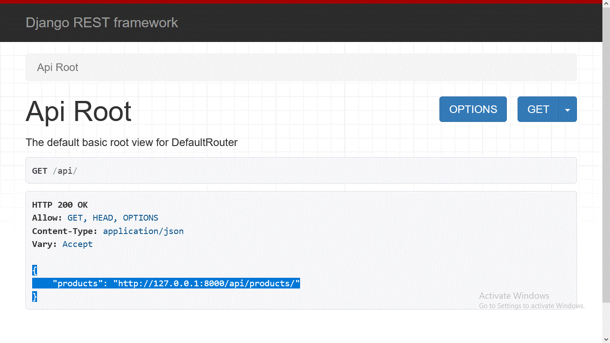
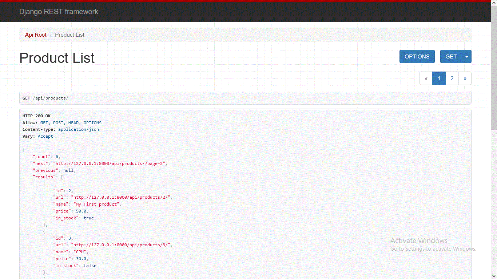

# Products Application:


# Technologies Used:
1. Django
2. Django REST Framework


# Models:
There is only one model, the Product Model.
<table>
	<tr>
		<th>Field Name</th>
		<th>Field Type</th>
		<th>Unique</th>
		<th>Minimum</th>
		<th>Maximum</th>
		<th>Required</th>
		<th>Can be modified</th>
	</tr>
	<tr>
		<th>ID</th>
		<td>Integer</td>
		<td>True</td>
		<td>-</td>
		<td>-</td>
		<td>Auto Generated</td>
		<td>False</td>
	</tr>
	<tr>
		<th>name</th>
		<td>string</td>
		<td>false</td>
		<td>-</td>
		<td>150</td>
		<td>True</td>
		<td>True</td>
	</tr>
	<tr>
		<th>price</th>
		<td>float</td>
		<td>false</td>
		<td>0.1</td>
		<td>1000000</td>
		<td>True</td>
		<td>True</td>
	</tr>
	<tr>
		<th>in_stock</th>
		<td>boolean</td>
		<td>false</td>
		<td>-</td>
		<td>-</td>
		<td>True</td>
		<td>True</td>
	</tr>
</table>


# Endpoints:

## 1) http://127.0.0.1:8000/api/
Returns the api Resources

```json
{
    "products": "http://127.0.0.1:8000/api/products/"
}
```




## 2) Product Endpoints:


## 2-1) (GET) http://127.0.0.1:8000/api/products/

Displays a paginated list of products, each page contains 5 results.




